## ESCUELA COLOMBIANA DE INGENIERÍA JULIO GARAVITO

## Arquitectura de Software - ARSW 

## Escalamiento en Azure con Maquinas Virtuales, Sacale Sets y Service Plans

## Integrante 

### yeisson Gualdron

#### Para el proceso de creación, de la maquina virtual en Azure seguí los siguientes pasos

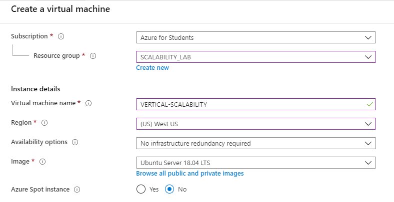

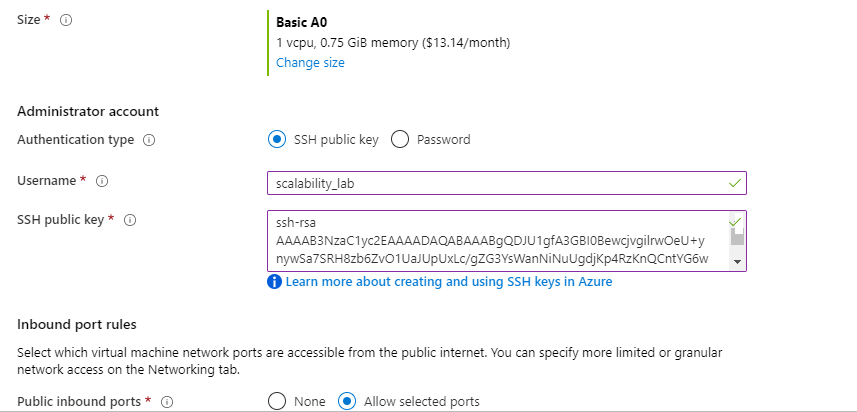

#### Luego de la creación azure nos notifica la maquina virtual se creo y desplego correctamente

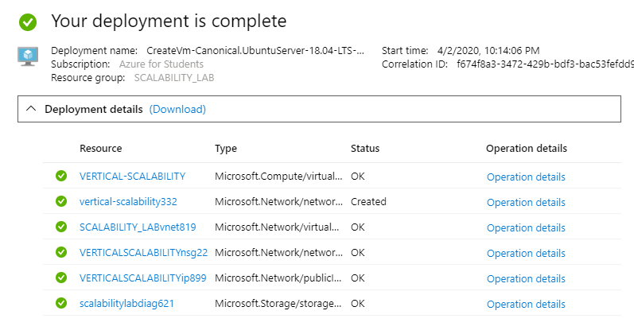

#### 1. Para conectarnos a la maquina virtual utilizamos el protocolo ssh, y el sisguiente comando

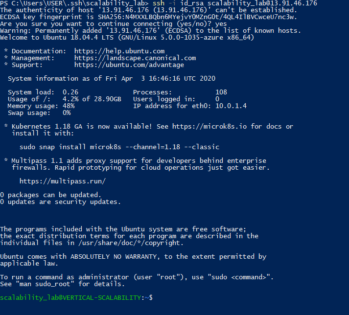

#### 2. Proceso de instalación 

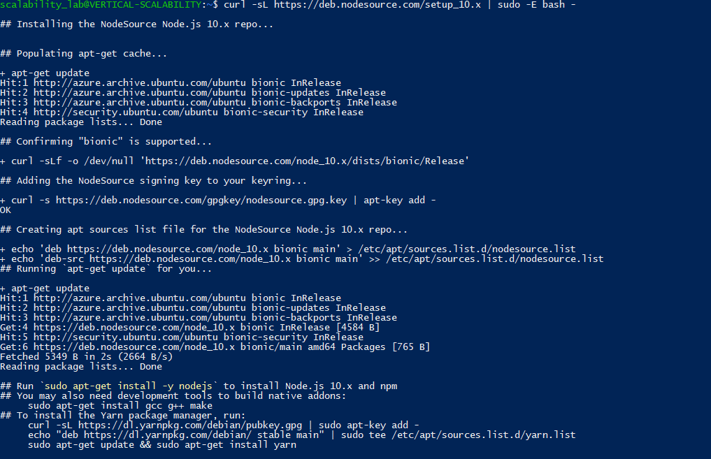

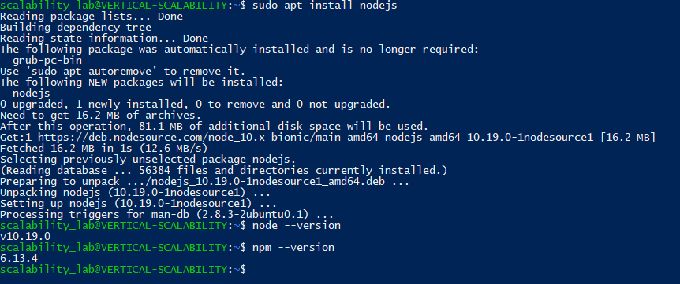

#### 3. creamos un repositorio en git y lo clonamos dentro de la VM y luego ejecutamos npm install

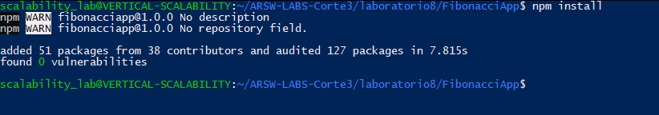

#### 4. instalamos forever y ejecutamos la aplicacion 

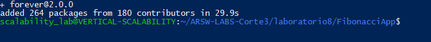

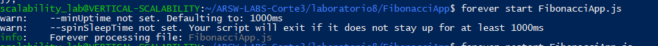

#### 5.Antes de verificar si el endpoint funciona, en Azure vaya a la sección de *Networking* y cree una *Inbound port rule* tal como se muestra en la imágen.
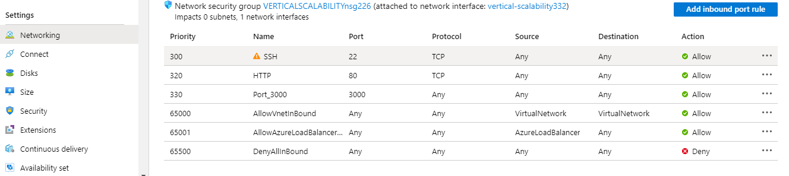

####  Para verificar que la aplicación funciona, use un browser y user el endpoint `http://xxx.xxx.xxx.xxx:3000/fibonacci/6`. La respuesta debe ser `The answer is 8`.

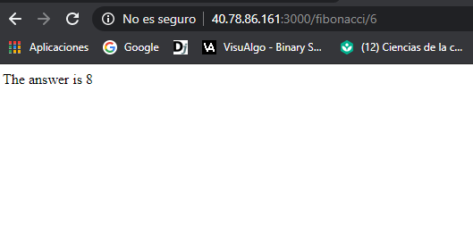

#### 7. La función que calcula en enésimo número de la secuencia de Fibonacci está muy mal construido y consume bastante CPU para obtener la respuesta. Usando la consola del Browser documente los tiempos de respuesta para dicho endpoint usando los siguintes valores: 

| Numero  | tiempo(mins) |
|---------|-------------:|
| 1000000 | 2.2          |
| 1010000 | 2.2          |
| 1020000 | 2.3          |
| 1030000 | 2.3          |
| 1040000 | 2.4          |
| 1050000 | 2.4          |
| 1060000 | 2.5          |
| 1070000 | 2.5          |
| 1080000 | 2.5          |
| 1090000 | 2.6          |

#### 8. Dírijase ahora a Azure y verifique el consumo de CPU para la VM. (Los resultados pueden tardar 5 minutos en aparecer). 

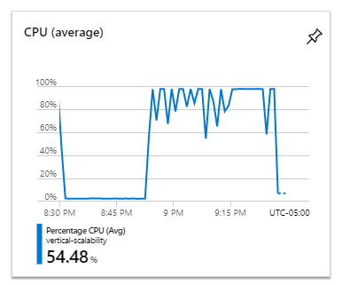

#### 9. Ahora usaremos Postman para simular una carga concurrente a nuestro sistema. Siga estos pasos.

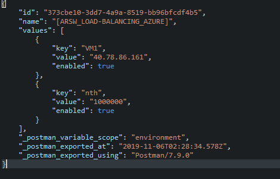

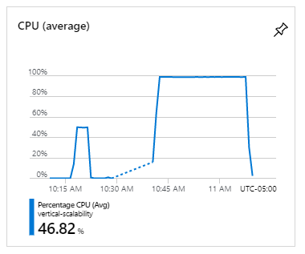

#### 10. La cantidad de CPU consumida es bastante grande y un conjunto considerable de peticiones concurrentes pueden hacer fallar nuestro servicio. Para solucionarlo usaremos una estrategia de Escalamiento Vertical. En Azure diríjase a la sección *size* y a continuación seleccione el tamaño `B2ms`.  No me fue posible cambiar al tamaño B2ms debido a la localización inicialmente utilizada para crear la VM, por lo cual utilice D2s_V3 ya que es muy similirar en recursos; comparten CPUs, RAM, dataDisks.

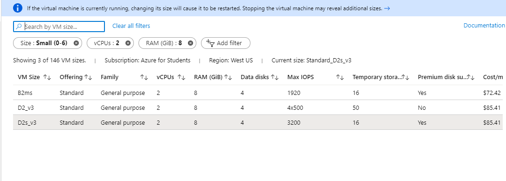

11. Una vez el cambio se vea reflejado, repita el paso 7, 8 y 9.

##### 7.

| Numero  | tiempo(seg)    |
|---------|---------------:|
| 1000000 | 23.36          |
| 1010000 | 24.34          |
| 1020000 | 24.82          |
| 1030000 | 24.57          |
| 1040000 | 25.77          |
| 1050000 | 25.23          |
| 1060000 | 26.87          |
| 1070000 | 33.56          |
| 1080000 | 27.34          |
| 1090000 | 27.02          |

##### 8.  

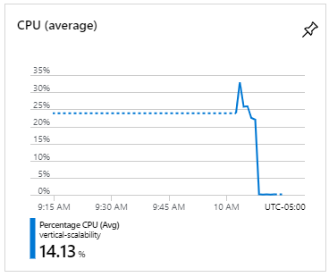

##### 9.  

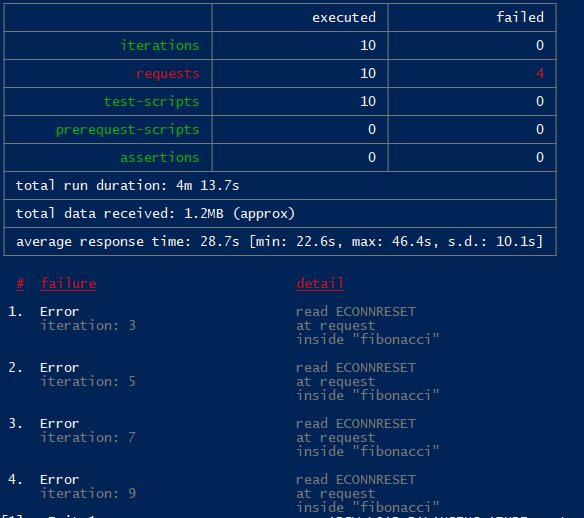

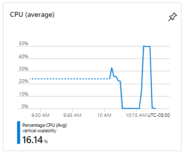

#### 1. ¿Cuántos y cuáles recursos crea Azure junto con la VM?
    
    * Virtual Network
    * Storage Account 
    * Public IP address
    * Network Security Group
    * Network Interface
    * Disk

#### 2. ¿Brevemente describa para qué sirve cada recurso?
    
    * Virtual Network : es una red privada en azure. permite que muchos tipos de recursos de azure,  
        se comuniquen de manera segura entre sí. 

    * Storage Account : La cuenta de almacenamiento proporciona un espacio de nombres único para sus  
        datos de Azure Storage al que se puede acceder desde cualquier lugar del mundo a través de HTTP o HTTPS. 
        Los datos en su cuenta de almacenamiento de Azure son duraderos y altamente disponibles,  
        seguros y escalables de forma masiva.

    * Public IP address : Puede asignar direcciones IP a recursos de Azure para comunicarse con otros 
        recursos de Azure, su red local e Internet. Hay dos tipos de direcciones IP que puede usar en Azure:

        Direcciones IP públicas : se utilizan para la comunicación con Internet, incluidos los servicios públicos de Azure.  
        Direcciones IP privadas : se utilizan para la comunicación dentro de una red virtual de Azure (VNet) y su red local,  
        cuando utiliza una puerta de enlace VPN o un circuito ExpressRoute para extender su red a Azure.

    * Network Security Group : Puede usar el grupo de seguridad de red de Azure para filtrar el tráfico de red y desde los  
        recursos de Azure en una red virtual de Azure. Un grupo de seguridad de red contiene reglas de seguridad que permiten  
        o niegan el tráfico de red entrante a, o el tráfico de red saliente, de varios tipos de recursos de Azure.  
        Para cada regla, puede especificar el origen y el destino, el puerto y el protocolo. Este artículo describe  
        las propiedades de una regla de grupo de seguridad de red, las reglas de seguridad predeterminadas que se aplican y  
        las propiedades de regla que puede modificar para crear una regla de seguridad aumentada .

    * Network Interface : Una interfaz de red permite que una máquina virtual de Azure se comunique con Internet,  
        Azure y recursos locales. Al crear una máquina virtual con Azure Portal, el portal crea una interfaz de red  
        con la configuración predeterminada para usted. En su lugar, puede optar por crear interfaces de red con  
        configuraciones personalizadas y agregar una o más interfaces de red a una máquina virtual cuando la cree.  
        También es posible que desee cambiar la configuración predeterminada de la interfaz de red para  
        una interfaz de red existente. 

    * Disk : Los discos administrados de Azure actualmente ofrecen cuatro tipos de discos, cada uno dirigido a escenarios 
        de clientes específicos.  unidades de estado sólido (SSD) premium, SSD estándar y unidades de disco duro estándar (HDD).

#### 3. ¿Al cerrar la conexión ssh con la VM, por qué se cae la aplicación que ejecutamos con el comando `npm FibonacciApp.js`? 
        El proceso de ejecución de FibonacciApp.js esta relacionado con la sesión de usuario por protocolo ssh, 
        por tanto al cerrar la conexión ssh el proceso se detiene. 
    ¿Por qué debemos crear un *Inbound port rule* antes de acceder al servicio?
        debemos crear un *Inbound port rule* para permitir el acceso al servicio ya que la maquina unicamente cuenta con  
        el puerto 22 y 80 de los cuales el purto 22 ya esta en uso debido a la conexión que tenemos por ssh y el puerto 
        80 únicamente permite trafico por protocolo HTTP, por lo cual es necesario este puerto que permite el trafico 
        libre.

#### 4. Adjunte tabla de tiempos e interprete por qué la función tarda tando tiempo.

    con maquina  Basic A0

| Numero  | tiempo(mins) |
|---------|-------------:|
| 1000000 | 2.2          |
| 1010000 | 2.2          |
| 1020000 | 2.3          |
| 1030000 | 2.3          |
| 1040000 | 2.4          |
| 1050000 | 2.4          |
| 1060000 | 2.5          |
| 1070000 | 2.5          |
| 1080000 | 2.5          |
| 1090000 | 2.6          |

    con maquina D2s_V3  

| Numero  | tiempo(seg)    |
|---------|---------------:|
| 1000000 | 23.36          |
| 1010000 | 24.34          |
| 1020000 | 24.82          |
| 1030000 | 24.57          |
| 1040000 | 25.77          |
| 1050000 | 25.23          |
| 1060000 | 26.87          |
| 1070000 | 33.56          |
| 1080000 | 27.34          |
| 1090000 | 27.02          | 

#### 5. Adjunte imágen del consumo de CPU de la VM e interprete por qué la función consume esa cantidad de CPU.

  
    
    Uso de CPU antes de realizar escalamiento vertical.

  

    Uso de CPU despues de realizar el escalamiento vertical.

    El consumo de CPU es bastante alto tanto en ambos casos, ya que en el primer caso el uso de cpu super el 75% de uso   
    y en el segundo caso llega a 50%; pero debemos tener en cuenta que la maquina del segundo caso tiene 2 vCPUs, por lo  
    cual esta utilizando 1 CPU al máximo. Esto es debido a que la función no utiliza el concepto de paralelismo,  
    no utiliza los multiples medios de ejecución física con los que cuenta la maquina. además, la función tiene una  
    complejidad lineal, lo cual implica un gran numero de iteraciones para calcular el resultado.  

#### 6. Adjunte la imagen del resumen de la ejecución de Postman. Interprete:
    * Tiempos de ejecución de cada petición.
    Basic A0   

    D2s_V3  

    * Si hubo fallos documentelos y explique.

    Tanto en Basic A0 como en D2s_v3 encontramos fallos a algunas de las peticiones que postman realizaba de forma concurrente  
    estos fallos nos indican que el  aumento size de la VM no es la solución optima para garantizar las respuestas a  
    solicitudes concurrentes.

#### 7. ¿Cuál es la diferencia entre los tamaños `B2ms` y `B1ls` (no solo busque especificaciones de infraestructura)?

#### 8. ¿Aumentar el tamaño de la VM es una buena solución en este escenario?, ¿Qué pasa con la FibonacciApp cuando cambiamos el tamaño de la VM?
    
    * Aumentar el tamaño no es una buena solución, ya que la función no utiliza los múltiples procesadores de la maquina,  
      tampoco permite resolver múltiples en tiempo real; lo que pone en riesgo la disponibilidad de el servicio.  

      * Cuando cambiamos el tamaño de la VM, fibonacciApp disminuye el tiempo requerido para resolver el número,  
        esto debido a que se cambio a un procesador mas rápido.  

#### 9. ¿Qué pasa con la infraestructura cuando cambia el tamaño de la VM? ¿Qué efectos negativos implica?
    
    * 

#### 10. ¿Hubo mejora en el consumo de CPU o en los tiempos de respuesta? Si/No ¿Por qué?  

    * Hubo mejora en el consumo de CPU ya que permanece en 50% esto debido a que la maquina a la cual se aumento  
    cuenta con 2 vCPUs y la función solo hace uso de una CPU.

    * Hubo mejora en el tiempo de respuesta de la función ya que los vCPUs de la VM a la cual se mejoro trabajan a una velocidad bastante mayor(Intel® Xeon® 8171M 2.1GHz ).

#### 11. Aumente la cantidad de ejecuciones paralelas del comando de postman a `4`. ¿El comportamiento del sistema es porcentualmente mejor?

    * El comportamiento del sistema no mejora porcentualmente,  

#### Bibliography 

https://docs.microsoft.com/en-us/azure

