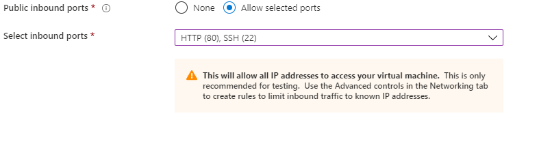

## ESCUELA COLOMBIANA DE INGENIERÍA JULIO GARAVITO

## Arquitectura de Software - ARSW 

## Escalamiento en Azure con Maquinas Virtuales, Sacale Sets y Service Plans

## Integrante 

### yeisson Gualdron

#### Para el proceso de creación, de la maquina virtual en Azure seguí los siguientes pasos

#### Luego de la creación azure nos notifica la maquina virtual se creo y desplego correctamente

