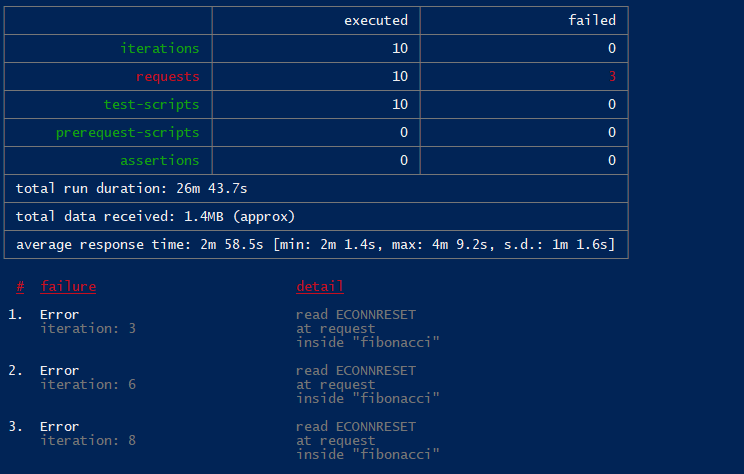

## ESCUELA COLOMBIANA DE INGENIERÍA JULIO GARAVITO

## Arquitectura de Software - ARSW 

## Escalamiento en Azure con Maquinas Virtuales, Sacale Sets y Service Plans

## Integrante 

### yeisson Gualdron

#### Para el proceso de creación, de la maquina virtual en Azure seguí los siguientes pasos


#### Luego de la creación azure nos notifica la maquina virtual se creo y desplego correctamente


#### 1. Para conectarnos a la maquina virtual utilizamos el protocolo ssh, y el sisguiente comando


#### 2. Proceso de instalación 


#### 3. creamos un repositorio en git y lo clonamos dentro de la VM y luego ejecutamos npm install


#### 4. instalamos forever y ejecutamos la aplicacion 


#### 5.Antes de verificar si el endpoint funciona, en Azure vaya a la sección de *Networking* y cree una *Inbound port rule* tal como se muestra en la imágen.


####  Para verificar que la aplicación funciona, use un browser y user el endpoint `http://xxx.xxx.xxx.xxx:3000/fibonacci/6`. La respuesta debe ser `The answer is 8`.


#### 7. La función que calcula en enésimo número de la secuencia de Fibonacci está muy mal construido y consume bastante CPU para obtener la respuesta. Usando la consola del Browser documente los tiempos de respuesta para dicho endpoint usando los siguintes valores: 


| Numero  | tiempo(mins) |
|---------|-------------:|
| 1000000 | 2.2          |
| 1010000 | 2.2          |
| 1020000 | 2.3          |
| 1030000 | 2.3          |
| 1040000 | 2.4          |
| 1050000 | 2.4          |
| 1060000 | 2.5          |
| 1070000 | 2.5          |
| 1080000 | 2.5          |
| 1090000 | 2.6          |


#### 8. Dírijase ahora a Azure y verifique el consumo de CPU para la VM. (Los resultados pueden tardar 5 minutos en aparecer). 


#### 9. Ahora usaremos Postman para simular una carga concurrente a nuestro sistema. Siga estos pasos.





#### 10. La cantidad de CPU consumida es bastante grande y un conjunto considerable de peticiones concurrentes pueden hacer fallar nuestro servicio. Para solucionarlo usaremos una estrategia de Escalamiento Vertical. En Azure diríjase a la sección *size* y a continuación seleccione el tamaño `B2ms`.  No me fue posible cambiar al tamaño B2ms debido a la localización inicialmente utilizada para crear la VM, por lo cual utilice D2s_V3 ya que es muy similirar en recursos; comparten CPUs, RAM, dataDisks.


11. Una vez el cambio se vea reflejado, repita el paso 7, 8 y 9.

##### 7.

| Numero  | tiempo(seg)    |
|---------|---------------:|
| 1000000 | 23.36          |
| 1010000 | 24.34          |
| 1020000 | 24.82          |
| 1030000 | 24.57          |
| 1040000 | 25.77          |
| 1050000 | 25.23          |
| 1060000 | 26.87          |
| 1070000 | 33.56          |
| 1080000 | 27.34          |
| 1090000 | 27.02          |

##### 8.  


##### 9.  


#### 1. ¿Cuántos y cuáles recursos crea Azure junto con la VM?
    
    * Virtual Network
    * Storage Account 
    * Public IP address
    * Network Security Group
    * Network Interface
    * Disk

#### 2. ¿Brevemente describa para qué sirve cada recurso?
    
    * Virtual Network : es una red privada en azure. permite que muchos tipos de recursos de azure,  
        se comuniquen de manera segura entre sí. 

    * Storage Account : La cuenta de almacenamiento proporciona un espacio de nombres único para sus  
        datos de Azure Storage al que se puede acceder desde cualquier lugar del mundo a través de HTTP o HTTPS. 
        Los datos en su cuenta de almacenamiento de Azure son duraderos y altamente disponibles,  
        seguros y escalables de forma masiva.

    * Public IP address : Puede asignar direcciones IP a recursos de Azure para comunicarse con otros 
        recursos de Azure, su red local e Internet. Hay dos tipos de direcciones IP que puede usar en Azure:

        Direcciones IP públicas : se utilizan para la comunicación con Internet, incluidos los servicios públicos de Azure.  
        Direcciones IP privadas : se utilizan para la comunicación dentro de una red virtual de Azure (VNet) y su red local,  
        cuando utiliza una puerta de enlace VPN o un circuito ExpressRoute para extender su red a Azure.

    * Network Security Group : Puede usar el grupo de seguridad de red de Azure para filtrar el tráfico de red y desde los  
        recursos de Azure en una red virtual de Azure. Un grupo de seguridad de red contiene reglas de seguridad que permiten  
        o niegan el tráfico de red entrante a, o el tráfico de red saliente, de varios tipos de recursos de Azure.  
        Para cada regla, puede especificar el origen y el destino, el puerto y el protocolo. Este artículo describe  
        las propiedades de una regla de grupo de seguridad de red, las reglas de seguridad predeterminadas que se aplican y  
        las propiedades de regla que puede modificar para crear una regla de seguridad aumentada .

    * Network Interface : Una interfaz de red permite que una máquina virtual de Azure se comunique con Internet,  
        Azure y recursos locales. Al crear una máquina virtual con Azure Portal, el portal crea una interfaz de red  
        con la configuración predeterminada para usted. En su lugar, puede optar por crear interfaces de red con  
        configuraciones personalizadas y agregar una o más interfaces de red a una máquina virtual cuando la cree.  
        También es posible que desee cambiar la configuración predeterminada de la interfaz de red para  
        una interfaz de red existente. 

    * Disk : Los discos administrados de Azure actualmente ofrecen cuatro tipos de discos, cada uno dirigido a escenarios 
        de clientes específicos.  unidades de estado sólido (SSD) premium, SSD estándar y unidades de disco duro estándar (HDD).

#### 3. ¿Al cerrar la conexión ssh con la VM, por qué se cae la aplicación que ejecutamos con el comando `npm FibonacciApp.js`? 
        El proceso de ejecución de FibonacciApp.js esta relacionado con la sesión de usuario por protocolo ssh, 
        por tanto al cerrar la conexión ssh el proceso se detiene. 
    ¿Por qué debemos crear un *Inbound port rule* antes de acceder al servicio?
        debemos crear un *Inbound port rule* para permitir el acceso al servicio ya que la maquina unicamente cuenta con  
        el puerto 22 y 80 de los cuales el purto 22 ya esta en uso debido a la conexión que tenemos por ssh y el puerto 
        80 únicamente permite trafico por protocolo HTTP, por lo cual es necesario este puerto que permite el trafico 
        libre.

#### 4. Adjunte tabla de tiempos e interprete por qué la función tarda tando tiempo.

    con maquina  Basic A0

| Numero  | tiempo(mins) |
|---------|-------------:|
| 1000000 | 2.2          |
| 1010000 | 2.2          |
| 1020000 | 2.3          |
| 1030000 | 2.3          |
| 1040000 | 2.4          |
| 1050000 | 2.4          |
| 1060000 | 2.5          |
| 1070000 | 2.5          |
| 1080000 | 2.5          |
| 1090000 | 2.6          |

    con maquina D2s_V3  

| Numero  | tiempo(seg)    |
|---------|---------------:|
| 1000000 | 23.36          |
| 1010000 | 24.34          |
| 1020000 | 24.82          |
| 1030000 | 24.57          |
| 1040000 | 25.77          |
| 1050000 | 25.23          |
| 1060000 | 26.87          |
| 1070000 | 33.56          |
| 1080000 | 27.34          |
| 1090000 | 27.02          | 


#### 5. Adjunte imágen del consumo de CPU de la VM e interprete por qué la función consume esa cantidad de CPU.

  
    
    Uso de CPU antes de realizar escalamiento vertical.

  

    Uso de CPU despues de realizar el escalamiento vertical.

    El consumo de CPU es bastante alto tanto en ambos casos, ya que en el primer caso el uso de cpu super el 75% de uso   
    y en el segundo caso llega a 50%; pero debemos tener en cuenta que la maquina del segundo caso tiene 2 vCPUs, por lo  
    cual esta utilizando 1 CPU al máximo. Esto es debido a que la función no utiliza el concepto de paralelismo,  
    no utiliza los multiples medios de ejecución física con los que cuenta la maquina. además, la función tiene una  
    complejidad lineal, lo cual implica un gran numero de iteraciones para calcular el resultado.  


#### 6. Adjunte la imagen del resumen de la ejecución de Postman. Interprete:
    * Tiempos de ejecución de cada petición.
    Basic A0   


    D2s_V3  


    * Si hubo fallos documentelos y explique.

    Tanto en Basic A0 como en D2s_v3 encontramos fallos a algunas de las peticiones que postman realizaba de forma concurrente  
    estos fallos nos indican que el  aumento size de la VM no es la solución optima para garantizar las respuestas a  
    solicitudes concurrentes.

#### 7. ¿Cuál es la diferencia entre los tamaños `B2ms` y `B1ls` (no solo busque especificaciones de infraestructura)?  


    |Name | vCPU | Memory (GiB) | Temp Storage (SSD) GiB | Base CPU Perf of VM | Max CPU Perf of VM | Max NICs|
    |:---:|:----:|:------------:|:----------------------:|:-------------------:|:------------------:|:-------:|
    |B1ls |  1   |     0.5      |            4           |          5%         |         100%       |    2    |
    |B2ms |  2   |     8        |            16          |          60%        |         200%       |    3    |


#### 8. ¿Aumentar el tamaño de la VM es una buena solución en este escenario?, ¿Qué pasa con la FibonacciApp cuando cambiamos el tamaño de la VM?
    
    * Aumentar el tamaño no es una buena solución, ya que la función no utiliza los múltiples procesadores de la maquina,  
      tampoco permite resolver múltiples en tiempo real; lo que pone en riesgo la disponibilidad de el servicio.  

      * Cuando cambiamos el tamaño de la VM, fibonacciApp disminuye el tiempo requerido para resolver el número,  
        esto debido a que se cambio a un procesador mas rápido.  

#### 9. ¿Qué pasa con la infraestructura cuando cambia el tamaño de la VM? ¿Qué efectos negativos implica?  
    
    Cuando se cambia el tamaño de la máquina virtual implica que esta se tenga que reiniciar, por lo que la aplicación se detiene y la disponibilidad disminuye. Al iniciar la máquina se debe volver a empezar el servicio de FibonacciApp. 

#### 10. ¿Hubo mejora en el consumo de CPU o en los tiempos de respuesta? Si/No ¿Por qué?  

    * Hubo mejora en el consumo de CPU ya que permanece en 50% esto debido a que la maquina a la cual se aumento  
    cuenta con 2 vCPUs y la función solo hace uso de una CPU.

    * Hubo mejora en el tiempo de respuesta de la función ya que los vCPUs de la VM a la cual se mejoro trabajan a una velocidad bastante mayor(Intel® Xeon® 8171M 2.1GHz ).


#### 11. Aumente la cantidad de ejecuciones paralelas del comando de postman a `4`. ¿El comportamiento del sistema es porcentualmente mejor?

    * El comportamiento del sistema mejora porcetualmente, ya que de pasa de 40% de fallo a un 25% de fallo. Por lo cual notamos  
    que el sistema necesita una solución a las solicitudes concurrentes.

### Parte 2 - Escalabilidad horizontal

#### Crear el Balanceador de Carga

Antes de continuar puede eliminar el grupo de recursos anterior para evitar gastos adicionales y realizar la actividad en un grupo de recursos totalmente limpio.

1. El Balanceador de Carga es un recurso fundamental para habilitar la escalabilidad horizontal de nuestro sistema, por eso en este paso cree un balanceador de carga dentro de Azure tal cual como se muestra en la imágen adjunta.


2. A continuación cree un *Backend Pool*, guiese con la siguiente imágen.


3. A continuación cree un *Health Probe*, guiese con la siguiente imágen.


4. A continuación cree un *Load Balancing Rule*, guiese con la siguiente imágen.


5. Cree una *Virtual Network* dentro del grupo de recursos, guiese con la siguiente imágen.


#### Crear las maquinas virtuales (Nodos)

Ahora vamos a crear 3 VMs (VM1, VM2 y VM3) con direcciones IP públicas standar en 3 diferentes zonas de disponibilidad. Después las agregaremos al balanceador de carga.

1. En la configuración básica de la VM guíese por la siguiente imágen. Es importante que se fije en la "Avaiability Zone", donde la VM1 será 1, la VM2 será 2 y la VM3 será 3.


2. En la configuración de networking, verifique que se ha seleccionado la *Virtual Network*  y la *Subnet* creadas anteriormente. Adicionalmente asigne una IP pública y no olvide habilitar la redundancia de zona.


3. Para el Network Security Group seleccione "avanzado" y realice la siguiente configuración. No olvide crear un *Inbound Rule*, en el cual habilite el tráfico por el puerto 3000. Cuando cree la VM2 y la VM3, no necesita volver a crear el *Network Security Group*, sino que puede seleccionar el anteriormente creado.


4. Ahora asignaremos esta VM a nuestro balanceador de carga, para ello siga la configuración de la siguiente imágen.


5. Finalmente debemos instalar la aplicación de Fibonacci en la VM. para ello puede ejecutar el conjunto de los siguientes comandos, cambiando el nombre de la VM por el correcto

```
git clone https://github.com/daprieto1/ARSW_LOAD-BALANCING_AZURE.git

curl -o- https://raw.githubusercontent.com/creationix/nvm/v0.34.0/install.sh | bash
source /home/vm1/.bashrc
nvm install node

cd ARSW_LOAD-BALANCING_AZURE/FibonacciApp
npm install

npm install forever -g
forever start FibonacciApp.js
```

Realice este proceso para las 3 VMs, por ahora lo haremos a mano una por una, sin embargo es importante que usted sepa que existen herramientas para aumatizar este proceso, entre ellas encontramos Azure Resource Manager, OsDisk Images, Terraform con Vagrant y Paker, Puppet, Ansible entre otras.

#### Probar el resultado final de nuestra infraestructura

1. Porsupuesto el endpoint de acceso a nuestro sistema será la IP pública del balanceador de carga, primero verifiquemos que los servicios básicos están funcionando, consuma los siguientes recursos:

```
http://52.155.223.248/
http://52.155.223.248/fibonacci/1
```

2. Realice las pruebas de carga con `newman` que se realizaron en la parte 1 y haga un informe comparativo donde contraste: tiempos de respuesta, cantidad de peticiones respondidas con éxito, costos de las 2 infraestrucruras, es decir, la que desarrollamos con balanceo de carga horizontal y la que se hizo con una maquina virtual escalada.
    

    Prueba de carga con balanceo vertical VM(D2s_v3)


    Prueba de carga con balanceo horizontal 3VM(A0)


    Tiempo de respuestas: podemos notar como el escalamiento vertical en algunos casos nos da unos tiempos de respuestas menores que en el  
    escalamiento horizontal, pero en otros el tiempo es mayor que todos los tiempos de el escalamiento horizontal. Cuando utilizamos el  
    escalamiento horizontal gestionamos mejor las solicitudes y garantizamos una mayor disponibilidad de un sitio web.

    Cantidad de peticiones respondidadas con exito: En escalamiento horizontal tenemos una execelente gestión de las peticiones, de tal  
    manera que se resuelven un 100% de las solicitudes mientras en el escalamiento vertical resolvemos un 70%  de las peticiones.

    Costos de infraestructura: para el escalamiento vertical tenemos el costo de la VM(B2ms)  0.092USD/hr  
    para el escalamiento horizontal tenemos el costo del balanceador mas las tres VM(A0) de 0.0406 USD/hr  
    En este caso resulta menos costoso el escalamiento vertical que el horizontal y mas eficiente.


3. Agregue una 4 maquina virtual y realice las pruebas de newman, pero esta vez no lance 2 peticiones en paralelo, sino que incrementelo a 4. Haga un informe donde presente el comportamiento de la CPU de las 4 VM y explique porque la tasa de éxito de las peticiones aumento con este estilo de escalabilidad.

```
newman run ARSW_LOAD-BALANCING_AZURE.postman_collection.json -e [ARSW_LOAD-BALANCING_AZURE].postman_environment.json -n 10 &
newman run ARSW_LOAD-BALANCING_AZURE.postman_collection.json -e [ARSW_LOAD-BALANCING_AZURE].postman_environment.json -n 10 &
newman run ARSW_LOAD-BALANCING_AZURE.postman_collection.json -e [ARSW_LOAD-BALANCING_AZURE].postman_environment.json -n 10 &
newman run ARSW_LOAD-BALANCING_AZURE.postman_collection.json -e [ARSW_LOAD-BALANCING_AZURE].postman_environment.json -n 10
```


    Podemos analizar que el consumo CPU promedio de las maquinas virtuales, se vio disminuido lo cual esta claramente evidenciado  
    por que se agrego una nueva maquina virtual la cual hace que disminuyan las solicitudes a los otros servidores en el entorno.  
    La tasa de exito se ve mejorada teóricamente ya que debido a que en el caso anterior teniamos una tasa de 100% de respuestas  
    lo cual no nos permite apreciar de forma practica la mejora.


    


**Preguntas**

* ¿Cuáles son los tipos de balanceadores de carga en Azure y en qué se diferencian?, ¿Qué es SKU, qué tipos hay y en qué se diferencian?, ¿Por qué el balanceador de carga necesita una IP pública?

    Tipos de balanceadores de carga en azure:  

    * balanceador de carga público : puede proporcionar conexiones salientes para máquinas virtuales (VM) dentro de su red virtual.  
     Estas conexiones se logran traduciendo sus direcciones IP privadas a direcciones IP públicas. Los equilibradores de carga  
     públicos se usan para equilibrar la carga del tráfico de Internet a sus máquinas virtuales.  

    * Balanceador de carga interno o privado puede proporcionar conexiones salientes para máquinas virtuales (VM) dentro de su  
     red virtual. Estas conexiones se logran traduciendo sus direcciones IP privadas a direcciones IP públicas.   
     Los equilibradores de carga públicos se usan para equilibrar la carga del tráfico de Internet a sus máquinas virtuales.

    * El balanceador de carga necesita una Ip publicaa ya que esta encargado de resolver las peticiones que provienen de afura,  
        es intermediario entre el internet y las maquinas virtuales. De esta forma las VMs nunca daran la cara al público.

* ¿Cuál es el propósito del *Backend Pool*?  

    El proposito del backend pool es proveer un alojamiento especifico a las maquinas virtuales, ya que las maquinas virtuales  
    son las que conforman el backend pool.    

* ¿Cuál es el propósito del *Health Probe*?  

    El health probe permite administrar el estado del balanceador de carga, permite detectar fallos en el backend pool,  
    informar de estos fallos, programar el momento en el cual se apagará el servicio. gestiona trafico entrante del  
    servicio.

* ¿Cuál es el propósito de la *Load Balancing Rule*? ¿Qué tipos de sesión persistente existen, por qué esto es importante y cómo puede afectar la escalabilidad del sistema?.  
    
    El proposito del Load Balancing Rule es establecer la configuración del trafico de red entrante y su distribucion  
    dentro del balanceador de carga. 

* ¿Qué es una *Virtual Network*? ¿Qué es una *Subnet*? ¿Para qué sirven los *address space* y *address range*?  
    
    Virtual network es una red privada la cual permite la comunicación de multiples servicios de azure de forma segura.  
    contiene todas las caracterizticas de una virtual network general tales como subredes, rango de direcciones,  
    públicas o privadas, además, en azure permite interconectar regiones.

    Una subnet permite segmentar una virtual network permitiendo de esta manera segmentar el rango de direcciones   
    segmentando de esta manera el trafico de la red. En azure permite la creación de recursos como grupos de  
    seguridad entre otros. 

    El address space es en conjunto de rangos de direcciones ip que contiene una Virtual network en azure.

    El address range es un rango de direcciones públicas o privadas consecutivas que existe en un espacio  
    dirección de red. 

* ¿Qué son las *Availability Zone* y por qué seleccionamos 3 diferentes zonas?. ¿Qué significa que una IP sea *zone-redundant*?  
    
    Availability zone es una ubicación física que provee baja latencia, alta disponibilidad  
    permitiendo de esta manera tener una separación de diferentes recursos y ubicación de ellos  
    dependiendo de lo crítico que sea su rol dentro del sistema.
    

* ¿Cuál es el propósito del *Network Security Group*?
    
    Un Network Security Group permite administrar de forma rápida la seguridad de todos los recursos   
    con los que contamos en azure, en el contenemos una lista de reglas detallada de trafico de red.

* Informe de newman 1 (Punto 2)
    
    Realizado en el lugar del enunciado.

* Presente el Diagrama de Despliegue de la solución.


#### Bibliography 

https://docs.microsoft.com/en-us/azure

